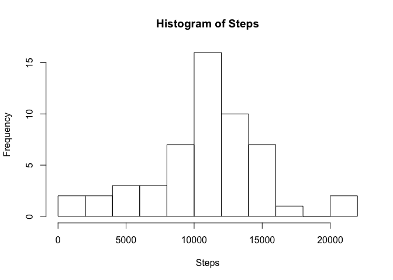

# Reproducible Research: Peer Assessment 1


## Loading and preprocessing the data

```r
activity_data <- read.csv("activity.csv")
cleaned_activity_data <- activity_data[!is.na(activity_data$steps),,]
total_steps <- aggregate(cleaned_activity_data$steps, by=list(cleaned_activity_data$date), FUN=sum)
barplot(total_steps$x, xlab="Date", ylab="Steps", main="Summary of Steps by Date")
axis(1, labels=c("10-01-2012", "10-31-2012", "11-30-2012"), at=c(1,31,63))
```

 

## What is mean total number of steps taken per day?
### Mean

```r
mean_steps <- aggregate(cleaned_activity_data$steps, by=list(cleaned_activity_data$date), FUN=mean)
barplot(mean_steps$x, xlab="Date", ylab="Steps", main="Mean Steps by Date")
axis(1, labels=c("10-01-2012", "10-31-2012", "11-30-2012"), at=c(1,31,63))
```

 

## What is the average daily activity pattern?

```r
mean_steps_by_interval <- aggregate(cleaned_activity_data$steps, by=list(cleaned_activity_data$interval), FUN=mean)
plot(mean_steps_by_interval$x, xlab="Interval", ylab="Steps", main="Mean Steps by Interval", type="l")
```

 

## Imputing missing values


## Are there differences in activity patterns between weekdays and weekends?
