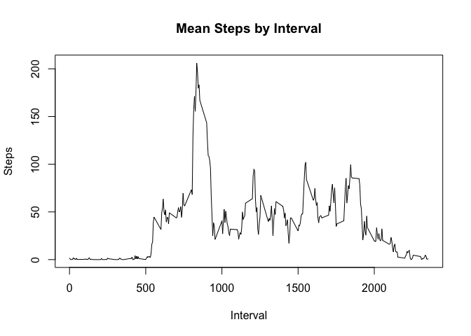

# Reproducible Research: Peer Assessment 1


## Loading and preprocessing the data

```r
activity_data <- read.csv("activity.csv")
total_steps <- aggregate(steps ~ date, data=activity_data, sum)
hist(total_steps$steps, xlab="Steps", main="Histogram of Steps", breaks=15)
```

 

## What is mean total number of steps taken per day?
### Mean

```r
mean(total_steps$steps)
```

```
## [1] 10766.19
```

### Median

```r
median(total_steps$steps)
```

```
## [1] 10765
```

## What is the average daily activity pattern?

```r
mean_steps_by_interval <- aggregate(steps ~ interval, data=activity_data, mean) 
plot(mean_steps_by_interval$interval, mean_steps_by_interval$steps, xlab="Interval", ylab="Steps", main="Mean Steps by Interval", type="l")
```

 

## Imputing missing values
### Number of samples that are NA

```r
length(activity_data[is.na(activity_data$steps),,]$steps)
```

```
## [1] 2304
```
### Cleaning data and imputing NAs

```r
impute_mean <- function(interval_id, value) {
     if (is.na(value))
       round(mean_steps_by_interval[mean_steps_by_interval$interval==interval_id,2],0)
     else
       value
}

cleansed_activity_data <- activity_data
n <- length(activity_data$steps)
for (i in 1:n) { cleansed_activity_data[i,1] <- impute_mean(cleansed_activity_data[i,3], cleansed_activity_data[i,1]) }
```

### Total Steps Histogram with Imputed Data

```r
cleansed_total_steps <- aggregate(steps ~ date, data=cleansed_activity_data, sum)
hist(cleansed_total_steps$steps, xlab="Steps", main="Histogram of Steps", breaks=15)
```

 

### Mean

```r
mean(cleansed_total_steps$steps)
```

```
## [1] 10765.64
```

### Median

```r
median(cleansed_total_steps$steps)
```

```
## [1] 10762
```
## Are there differences in activity patterns between weekdays and weekends?
